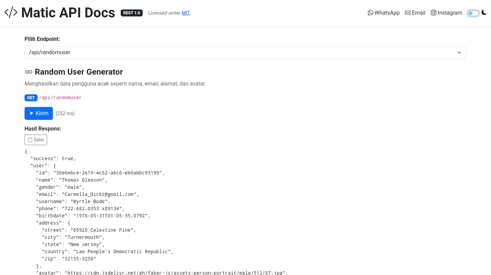
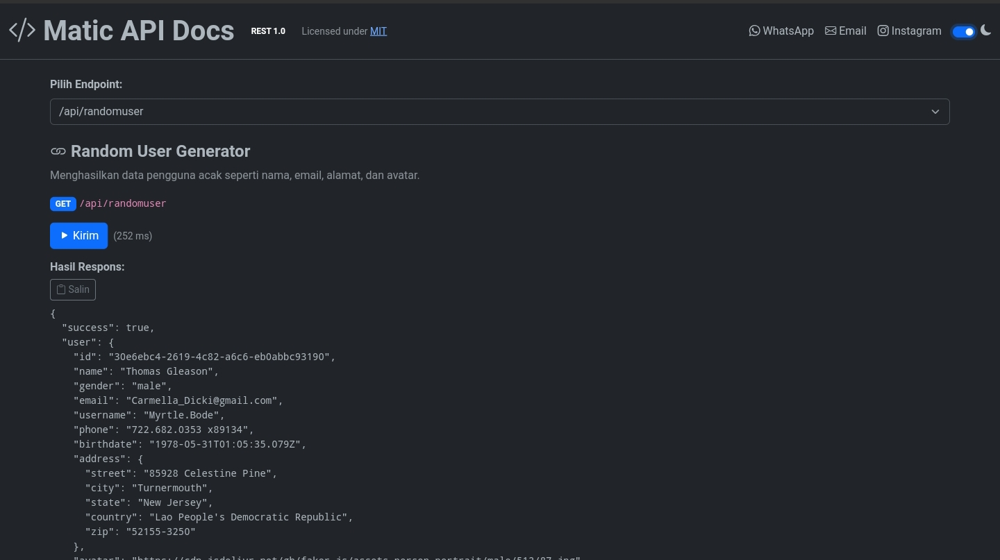

### API-MATIC

<p align="center">
  
  
</p>


---

Simple RESTful API with `TEST` on Frontend

---

#### Endpoints

- **`GET /api/embed`**
- **`GET /api/whois`**
- **`GET /api/shorten`**
- **`GET /api/randomuser`**
- **`GET /api/iplocator`**
- **`POST /api/docparser`**
- **`POST /api/qrcode`**
- **`POST /api/deepseek`**
- **`POST /api/gemini`**
- **`POST /api/llama`**
- **`POST /api/microsoft`**
- **`POST /api/nvidia`**
- **`POST /api/ssl`**
- **`POST /api/metadata`**
- **`GET /api/dns`**
- **`POST /api/translate`**
- **`POST /api/currency`**
- **`POST /api/asciiart`**
- **`POST /api/hash`**
- **`POST /api/leet`**

---
#### Pull Docker Image

```bash
docker pull smmurda/matic-api:latest
```

#### Run Container

```bash
docker run -d -p 3000:3000 --name matic-api smmurda/matic-api:latest
```
---
#### Notes

- Bitly shortening requires API key configuration in `.env`
- Video embedding (puppeteer) supports limited domains like:
  - `*videos.com, xn*x.com & p*rnh*b.com`
- Ensure all URLs or IPs are valid and publicly accessible
- Files & OCR in /api/docparser supports
  - `.jpeg, .png, .jpeg .pdf, .docx, .json, .html, .md, & csv`
- Last update for frontend checking api its have bug `day up` & `total req today`. you can update(create) `database` for solve
