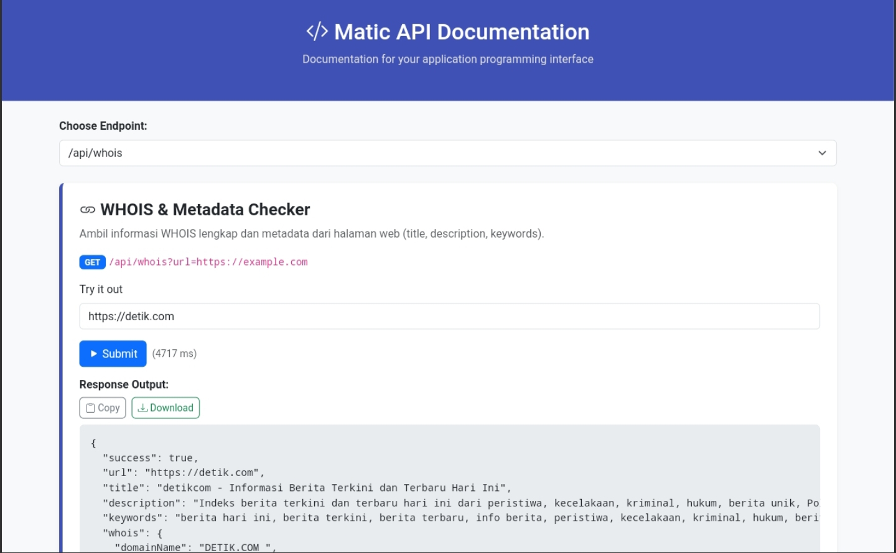
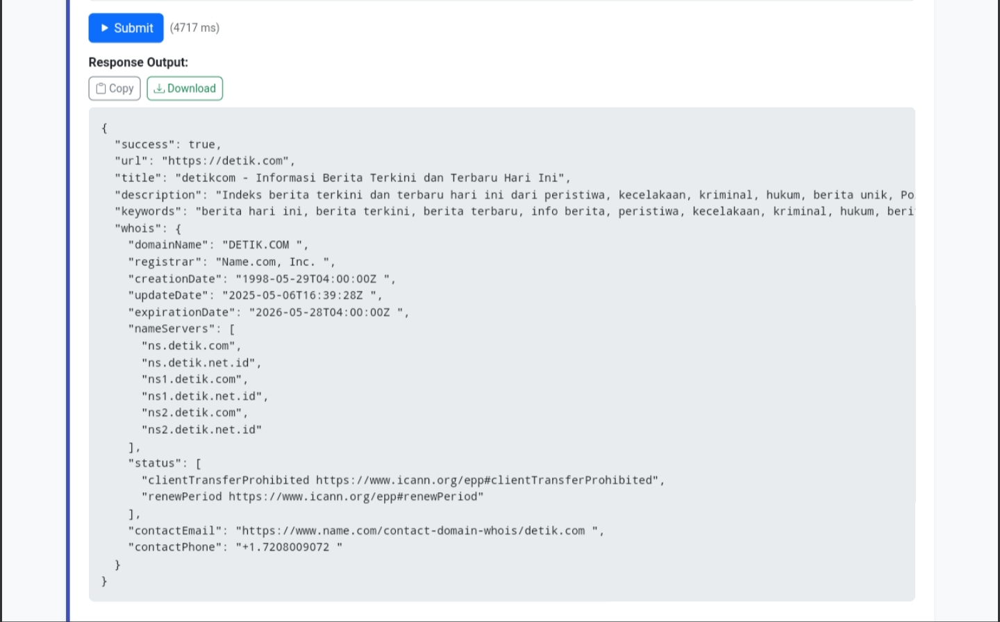

### API-MATIC

<p align="center">
  
  
</p>


---

Simple public API collection for tasks like video embedding, domain WHOIS lookup, URL shortening, IP geolocation, and generating fake user data.

#### Endpoints

| Endpoint           | Method | Description                                       | Example Usage                                                                 |
|--------------------|--------|---------------------------------------------------|--------------------------------------------------------------------------------|
| `/api/embed`       | GET    | Extract video metadata from supported sites       | `/api/embed?url=https://www.p*rnh*b.com/view_video.php?viewkey=ph5e3c2f8d9148d` |
| `/api/whois`       | GET    | Fetch WHOIS information for a domain              | `/api/whois?url=https://example.com`                                          |
| `/api/shorten`     | GET    | Shorten a long URL using Bitly                    | `/api/shorten?url=https://example.com`                                        |
| `/api/randomuser`  | GET    | Generate a random fake user profile               | `/api/randomuser`                                                             |
| `/api/iplocator`   | GET    | Get detailed geolocation info from an IP address  | `/api/iplocator?ip=8.8.8.8`                                                   |

#### Pull Docker Image

```bash
docker pull smmurda/matic-api
```
or
```bash
docker pull ghcr.io/smmurda/api-matic/matic-api:latest
```

---

#### Run Container

```bash
docker run -d -p 3000:3000 --name matic-api ghcr.io/smmurda/api-matic/matic-api:latest
```

#### Notes

- Bitly shortening requires API key configuration in `.env`
- Video embedding supports limited domains:
  - `*videos.com`
  - `xn*x.com`
  - `p*rnh*b.com`
- Ensure all URLs or IPs are valid and publicly accessible
